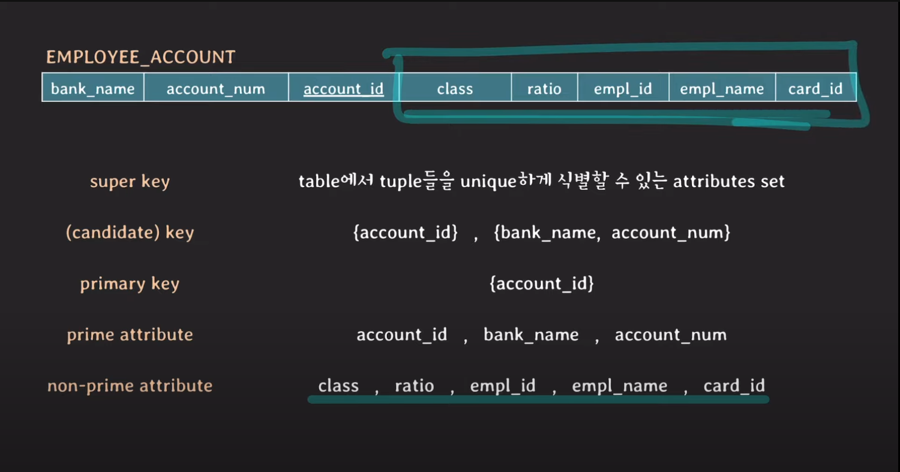

## 데이터베이스 객체

데이터베이스 객체란 테이블이나 뷰, 인덱스 등 데이터베이스 내에 정의하는 모든 것을 일컫는 말입니다.

- 기존 이름이나 예약어와 중복하지 않는다
- 언더스코어(_) 이외의 기호는 사용할 수 없다.
- 시스템이 허용하는 길이를 초과하지 않는다.

```bash
// bash
mysql -u root -p // sql 로그인 

// sql
CREATE SCHEMA `스키마_이름` DEFAULT CHARACTER SET utf8;
```

데이터베이스 객체는 스키마라는 네임스페이스 범위에서 생성됩니다. 우리는 mysql을 설치하고 스키마를 기준으로 여러 서비스의 DB를 생성할 수 있습니다. 스키마를 기준으로 데이터들이 구조화하고 정리됩니다.
<br/>


<br/>


## 테이블 작성, 삭제, 변경

DDL 명령어들은 데이터를 정의하거나 스키마 내의 객체를 관리할 때 사용됩니다.

- DML : SELECT, INSERT, DELETE, UPDATE 등 데이터를 조작하는 명령
  <br/>


### 테이블 작성

```sql
CREATE TABLE 테이블명
 -> id INT NOT NULL AUTO_INCREMENT,
 -> commenter INT NOT NULL,
 -> comment VARCHAR(100) NOT NULL,
 -> created_at DATETIME NOT NULL DEFAULT now(),
 -> INDEX commenter_idx (commenter ASC),
 -> id INT NOT NULL AUTO_INCREMENT
 ->;
// 마지막은 항상 세미콜론 까먹지 않기
```

RDBMS에서 데이터베이스 상에 제일 먼저 만드는 객체 중 하나가 바로 테이블입니다. `CREATE TABLE` 에 이어서 작성하고 싶은 테이블과 컬럼들의 타입을 나열해줍니다.

```sql
DESC 테이블명;
```

테이블의 컬럼 구성을 확인할 수 있습니다.
<br/>


### 테이블 삭제

```sql
// 테이블 삭제
DROP TABLE 테이블명;

// 테이블 구성은 유지하고 전체 레코드 삭제
DELETE FROM 테이블명;

// 테이블 구성은 유지하고 전체 레코드 삭제, 위 명령어보다 속도가 빠름
TRUNCATE TABLE 테이블명;
```

데이터베이스에서 테이블을 삭제하는 명령어입니다. 만약 테이블 정의는 그대로 둔채 삭제하고 싶다면 `DELETE` 명령으로 실행해야합니다. 처리속도를 빠르게 하고 싶을 땐 `TRUNCATE TABLE` 을 사용합니다.
<br/>


### 테이블 변경

```sql
ALTER TABLE 테이블명 변경명령;
// 1. 컬럼 추가
ALTER TABLE 테이블 ADD 열정의;

// 2. 컬럼의 타입, 제약 변경
ALTER TABLE 테이블 MODIFY 열정의;

// 3. 컬럼의 이름 변경
ALTER TABLE 테이블 CHANGE `기존 열명` `신규 열명`;

// 4. 컬럼 삭제
ALTER TABLE 테이블 DROP `기존 열명`;
```

`ALTER TABLE` 명령어는 테이블을 생성한 뒤에 변경하고 싶을 때 사용합니다. 구성된 컬럼, 제약을 추가, 삭제, 변경할 수 있습니다.

- `MODIFY` : 변경을 시도할 때 레코드들의 데이터 또한 같이 변환되는데 실패 시 ALTER 명령도 중지됨
  <br/>


<br/>


## 제약

### 테이블 작성시 제약 정의

테이블에서는 각 열을 정의하면서 제약을 정할 수 있습니다.

```sql
CREATE TABLE 테이블명 (
	a INTEGRER NOT NULL,
	b INTEGRER NOT NULL UNIQUE,
	c INTEGRER DEFAULT 1,
	d INTEGRER CHECK(d > 10),
	name VARCHAR(30),
	CHECK (a < b)
);
```

열에 대해 정의하는 제약을 열제약이라고 부릅니다. 열 제약에는 많은 키워드가 있습니다.

- `DEFAULT “value”` : 레코드가 생성될 때 기본값을 제공합니다.
- `CHECK(열명 조건문)` : 조건문을 만족해야만 레코드를 생성할 수 있게 할 수 있습니다.
- `NOT NULL` : NULL 값을 제한하는 제약입니다.
- `UNIQUE` : 테이블에서 중복되는 값을 제한하는 제약입니다.

```sql
CREATE TABLE 테이블명 (
	age INT CONSTRAINT age_over_20 CHECK(age > 20)
	age2 INT CHECK(age2 > 20)
);
```

`CONSTRAINT` 키워드를 사용하면 제약사항에 이름을 붙일 수 있습니다. 이름을 붙이는 이유는 DB에서 제약사항을 위반하여 메세지를 보내줄 때 자동으로 생성되는 이름이 아닌 우리가 선언한 이름으로 보여줄 수 있습니다.

- 붙였을 때 : Check constraint ‘age_over_20’ is violated.
- 붙이지 않았을 때 : Check constraint ‘테이블명_chk1’ is violated.
  <br/>


### 제약 변경

```sql
ALTER TABLE 테이블명 MODIFY 열명 VARCHAR(10) NOT NULL;
```

모든 열 추가, 이름 변경, 타입 변경, Key 변경, 추가 등등 테이블의 Schema를 변경하고 싶을 때는 `ALTER TABLE` 이라는 키워드로 시작합니다.

```sql
ALTER TABLE 테이블명 MODIFY 열명 타입;
```

제약을 삭제하거나 업데이트할 때는 `MODIFY` 키워드를 사용하여 다시 선언해주는 방식으로 변경합니다.

```sql
ALTER TABLE 테이블명 DROP CONSTRAINT 제약명;
ALTER TABLE 테이블명 DROP PRIMARY KEY;
```

테이블 제약의 경우에는 DROP 명령을 추가로 사용해야합니다.
<br/>

## Key

테이블에서의 키는 테이블의 한 레코드를 특정할 수 있는 검색키입니다. 기본키 제약이 설정된 테이블에서는 기본키로 검색했을 때 복수의 행이 조회될 수 없습니다. 또한 RDBMS에서는 설계에 따라서 데이터의 중복을 제거하기 위해 여러 테이블로 분리되는데 테이블의 특정 키를 저장할 때도 사용됩니다.

### key의 정의



> tuple - 각 attribute의 값으로 이루어진 리스트
> 1. **super key** : table에서 tuple들을 unique하게 식별할 수 있는 attributes set
> 2. **canidate key(후보키)** : 어느 한 attribute라도 제거하면 unique하게 tuples를 식별할 수 없는 super key 
>    - ex) { bank_name, account_num } 에서 한가지 attribute라도 빠지면 튜플 값을 결정할 수 없을 때
> 3. **primary key** : table에서 tuple들을 unique하게 식별하려고 선택된 (canidate) key 
>    - 보통은 primary key를 attribute가 적은 것으로 고릅니다.
> 4. unique key(대체키) : primary key가 아닌 canidate key
> 5. **foreign key(외래키)** : 다른 테이블의 Primary Key
> 6. prime attribute : 임의의 key에 속하는 attribute
> 7. non-prime attribute : 어떤 key에도 속하지 않는 attribute

<br/>

# reference

https://www.youtube.com/watch?v=c8WNbcxkRhY&list=PLcXyemr8ZeoREWGhhZi5FZs6cvymjIBVe&index=3