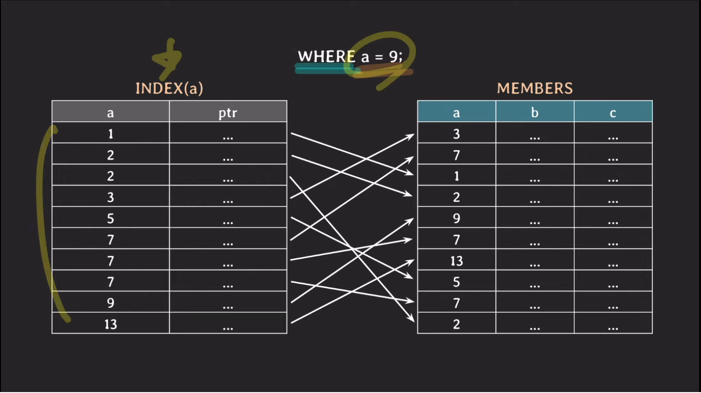
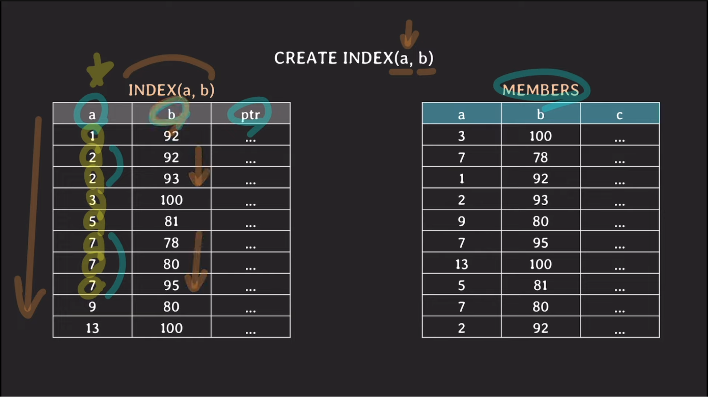
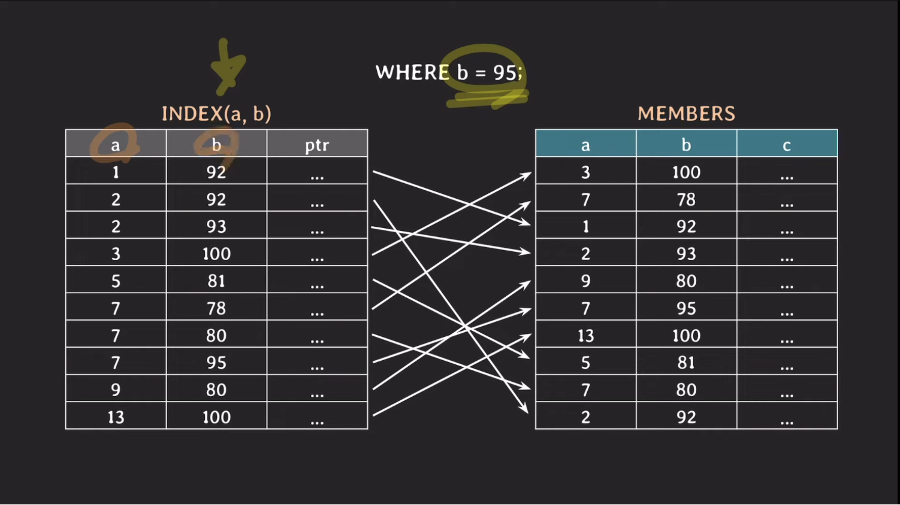
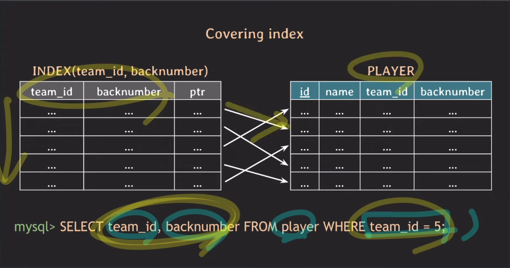

## 인덱스란?

RDBMS는 기본적으로 테이블을 조회할 때 첫 레코드부터 마지막 레코드까지 차례차례 검사하며 조건에 맞는 행을 조회합니다. (`full scan`) 

이럴 때 인덱스를 활용하면 테이블에 색인을 붙여 검색속도를 올릴 수 있습니다. 

- 빠르게 원하는 레코드를 찾을 때
- 빠르게 정렬하거나(`ORDER BY`) 그룹핑하기 위해(`GROUP BY`)
- 특정 조건을 만족하는 검색

## 인덱스 생성하기

```sql
CREATE INDEX 인덱스_별칭 ON 테이블 (컬럼명, ...)

CREATE INDEX player_name_idx ON player (name)
// 멀티 컬럼 인덱스
CREATE UNIQUE INDEX team_id_backnumber_idx ON player(team_id, backnumber);
```
테이블이 생성되어있을 때는 `CREATE INDEX` 키워드를 사용하여 한 컬럼 또는 여러 컬럼을 묶어 인덱스를 생성해줄 수 있습니다. 
인덱스가 중복되는 값이 있을 수 없는 unique한 컬럼 또는 컬럼 리스트에 생성된다면 `UNIQUE`라는 키워드를 사용해주기도 합니다.  
- 보통의 RDBMS는 테이블의 `PRIMARY KEY`로 인덱스를 생성해놓습니다.

```sql
CREATE TABLE 테이블명 (
    열명 타입,
    INDEX 인덱스_별칭 (열명)
);
```
테이블을 생성할 때도 인덱스를 생성해줄 수 있습니다.

```sql
SHOW INDEX FROM 테이블명;
```
생성한 인덱스를 확인하는 명령어입니다. 조회되는 데이터에는 다음과 같은 목록들이 있습니다. 
SHOW INDEX는 표준 SQL이 아니므로 인덱스를 확인할 때는 RDBMS 공식 문서를 참고해야합니다. 현재 글은 [MariaDB - SHOW INDEX
](https://mariadb.com/kb/en/show-index/) 기준으로 작성되었습니다.  
- Non_unique : 인덱스가 중복 값을 허용하는 경우 1, 값이 고유해야 하는 경우 0입니다.
- Column_name : 인덱스를 생성한 열명
- Seq_in_index : 멀티컬럼 인덱스인 경우 1,2,3 순서대로 증가됨.
- index_type : 인덱스 유형은 BTREE, FULLTEXT, HASH 또는 RTREE일 수 있습니다.


## 이진 탐색으로 인덱스를 이해해보기

```text
찾으려는 값 3              
<-- 1 2 3 4 5 6 7 8 9 10 -->
중간값 5보다 3이 큰가?
1 2 3 4 5
중간값 2보다 3이 큰가? 
3 4 5 
중간값 4보다 3이 큰가? 
3
```
이진 탐색(`binary search`)은 전체를 반으로 나눠 중간의 값이 찾으려는 값보다 작으면 왼쪽의 반을 가져와 다시 반복하고
중간의 값이 찾으려는 값보다 크다면 오른쪽의 반을 가져와 다시 반복합니다. 이 작업들은 값을 찾을 때까지 반복됩니다. 

전체의 갯수를 하나하나 조회하는 것보다 횟수가 훨씬 줄어든 것을 확인할 수 있습니다.




인덱스가 생성되면 RDBMS에서는 위 사진과 같이 각 column의 값과 각 레코드가 위치한 곳을 기억하는 포인터를 테이블로 생성하고 정렬합니다. 

```sql
SELECT * FROM 테이블명 WHERE a = 7 AND b = 95;
```

쿼리문이 실행되면 인덱스 테이블에서는 a = 7인 행을 찾기 시작합니다.
인덱스 테이블에서는 a의 값으로 이진 탐색(binary search)하기 시작합니다.
그 다음 조회된 행 중에서 b = 95를 만족하는 행이 있는지 전체 탐색(full scan)합니다.

- 인덱스가 아닌 컬럼 조건을 찾기 위해 full scan해야 되는 행이 많을수록 인덱스를 건 의미가 무의미해질 수 있기 때문에 멀티 컬럼으로 인덱스를 생성하기도 합니다.



멀티 컬럼으로 인덱스를 생성할 때는 인덱스 테이블이 정렬하는 방식을 고려해야 합니다. 위 사진과 같이 왼쪽 컬럼부터 정렬하기 때문에 최대한 유니크한 쪽으로 생성하는 것이 좋습니다. 

```sql
WHERE b = 95;
```

멀티 컬럼 인덱스에서는 한 컬럼으로만 조회할 경우 오히려 성능이 안좋아지는 결과가 생길 수 있습니다. 
b의 경우에는 정렬이 되어있지 않기 때문에 전체 탐색하는 것과 다르지 않습니다.
이럴 때는 b의 인덱스를 새로 생성해줍니다. 

:::tip
사용되는 쿼리에 맞춰서 적절하게 인덱스를 걸어줘야 쿼리가 빠르게 처리될 수 있다.
:::



한 컬럼이 여러 인덱스가 생성되어있을 때는 쿼리문이 어느 인덱스로 조회될지 헷갈릴 수 있습니다. 그럴 때는 `EXPLAIN` 키워드를 사용해 눈으로 확인할 수 있습니다.
- 보통은 DB optimizer가 적절하게 인덱스를 선택합니다.

```sql
SELECT * FROM player 
	USE INDEX(backnumber_idx) 
	WHERE backnumber = 7;

SELECT * FROM player 
	FORCE INDEX(backnumber_idx) 
	WHERE backnumber = 7;
```
또한 USE INDEX, FORCE INDEX 키워드를 사용해 어떤 인덱스를 사용할지 정할 수 있습니다.
- USE : RDBMS에 권장만 하고 확정은 아님
- FORCE : 강제 선택

## 인덱스를 지정할 때 고려사항

인덱스를 생성할 때는 다음과 같은 트레이드 오프가 있기 때문에 불필요하게 생성해서는 안됩니다.

- 인덱스를 생성하면 추가적인 저장 공간을 차지합니다.
- TABLE에 WRITE 작업이 발생하면 인덱스 테이블 또한 RDBMS에서 업데이트해줘야하는 부담이 있습니다.

또한 오히려 전체 탐색이 더 좋은 경우도 존재합니다.
- 테이블에 레코드가 많지 않을 때
- 조회하려는 데이터가 테이블 전체의 상당 부분을 차지할 때
  - ex. 컬럼 값이 Enum 또는 몇개로 고정되어있다면 인덱스를 생성할 때 전체 테이블을 복제하는 셈이 된다.

하지만 쿼리의 성능을 높이려면 인덱스를 사용해야 되는 케이스도 많기 때문에 인덱스를 지정하기 전에 고려해볼 몇가지 사항들을 작성해보았습니다.

### 1. Column Size

데이터베이스 서버가 검색하거나 인덱싱해야 하는 데이터가 적을수록 속도가 빨라지고 디스크에서 사용하는 스토리지가 줄어들기 때문에 인덱싱하는 열의 크기를 고려해야 합니다. 테이블을 생성할 때부터 열 사이즈를 항상 의식해주는 것이 좋습니다.

- 사람의 나이의 경우 INT보다 0~255 범위의 TINYINT UNSIGNED가 더 효율적일 수 있다.
- 문자열이 고정될 경우 VARCHAR보다 ENUM(””…) 1byte가 더 좋을 수 있다.
- **`PROCEDURE ANALYSE`** 키워드를 사용하면 할당되고 있는 메모리 정보를 얻을 수 있습니다.

### 2. Cardinality

> 카디널리티(Cardinality)란 해당 컬럼의 **중복된 수치**를 나타냅니다.
성별, 학년 등 중복이 많으면 카디널리티가 낮다.
계좌번호 등 유니크할수록 카디널리티가 높다.
>

인덱스는 유니크한, 즉 카디널리티가 높은 컬럼을 잡는 것이 좋습니다. 예를 들어 인덱싱한 열로 조회했을 때 찾는 데이터가 전체의 50프로라면 인덱싱으로 찾는 게 의미가 없을 수 있습니다.

- `DISTINCT` 명령어를 사용해서 중복도를 체크해보는 것이 좋습니다.
- DB optimizer는 조회되는 양에 따라 인덱스를 사용하지 않고 테이블 스캔을 할 수도 있습니다.
- 멀티 컬럼 인덱스를 한다면 카디널리티가 높은 순에서 낮은순으로 구성해야 성능이 더 뛰어납니다. 인덱스는 왼쪽 컬럼을 기준으로 정렬하기 때문입니다.
- 특이케이스 : 카디널리티가 낮아도 데이터 분포의 특성상 인덱스로 적절할 수도 있습니다.

### 3. 업데이트 빈번도

인덱스는 실제로 데이터가 바뀌면 업데이트해줘야하기 때문에 너무 변경이 잦은 컬럼은 피하는 것이 좋습니다. 또한 그런 이유에서 인덱스를 한 테이블의 3~4개만 사용하기를 권장합니다.


## Covering INDEX

```sql
SELECT a, b FROM 테이블 WHERE b = 5;
```

인덱스를 생성할 때 인덱스 컬럼에 조회하려는 컬럼이 포함되어있으면 성능에 이득을 볼 수 있습니다. 
인덱스 테이블에 이미 해당 컬럼들이 포함되어있어 포인터에 들를 필요없이 바로 반환할 수 있기 때문입니다.

## Hash INDEX

hash table을 사용하여 인덱스를 구현한 케이스로 시간복잡도가 O(1)입니다. 다만 단점도 존재합니다.
- rehashing에 대한 부담 
  - 자료가 쌓이면 어느 순간에는 사이즈를 늘려줘야 함 
- 범위 비교 불가능
- 멀티 칼럼 인덱스의 경우 개별이 아닌 인덱스를 생성한 컬럼 전체로 조회해야만 가능

## referecnce

- [쉬운 코드 - DB 인덱스(DB index)](https://youtu.be/IMDH4iAQ6zM?si=MDaNksmGAX6mFF0S)
- [향로 - 인덱스 정리 및 팁](https://jojoldu.tistory.com/243)
- [What makes a good MySQL index?](https://webmonkeyuk.wordpress.com/2010/09/22/what-makes-a-good-mysql-index-part-1-column-size/) 

