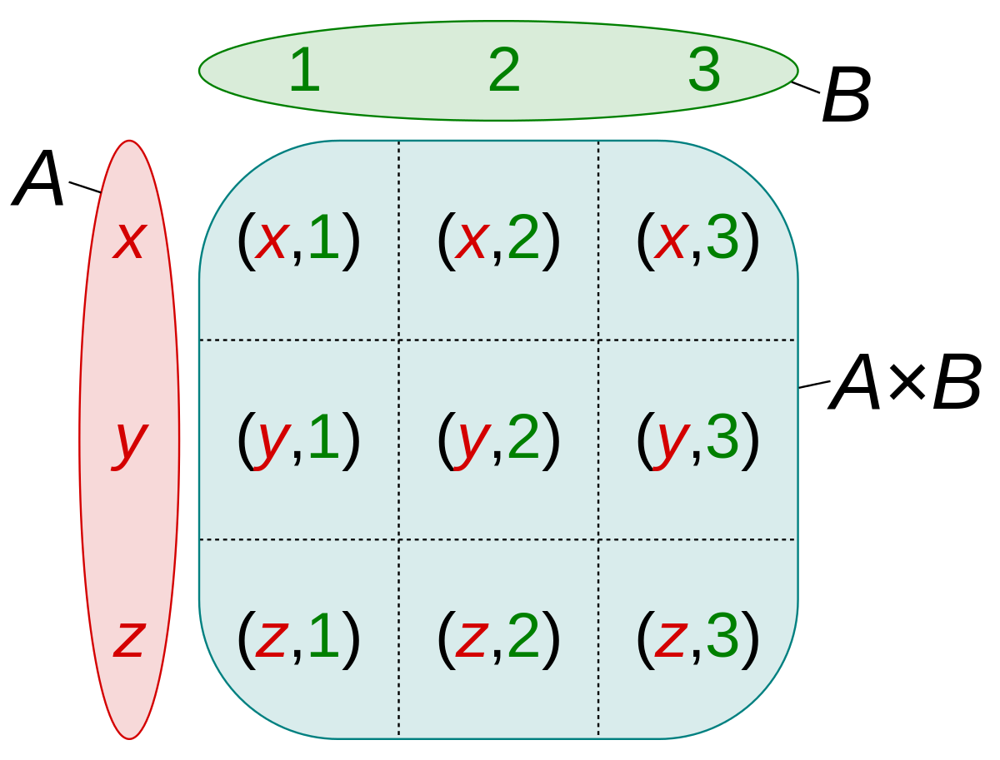

## 집합 연산

관계형 데이터베이스의 관계형은 수학 집합론의 관계형 이론에서 유래했습니다. 데이터베이스에서 SELECT해서 조회하는 행들은 하나의 집합으로 간주되곤 하며 키워드들도 집합에 비롯된 것이 많습니다.

```sql
SELECT * FROM A
UNION (ALL)
SELECT * FROM B;
```

수학에서 합집합 기호는 U는 `UNION` 이라는 키워드로 RDBMS에서 사용됩니다. `UNION` 을 이용하면 여러 개의 SELECT 명령을 하나로 묶을 수 있습니다.

- 열의 개수와 자료형이 같아야만 사용할 수 있습니다.
- ALL 키워드를 붙이면 중복까지 모두 합치고 붙이지 않으면 DISTINCT와 같이 1개만 남깁니다.

```sql
SELECT a FROM A
UNION
SELECT b FROM B ORDER BY b;
```

UNION에서 정렬을 사용하고 싶을 경우 마지막 SELECT 명령 뒤에 ORDER BY를 지정해줍니다.

```sql
SELECT a FROM A
INTERSECT
SELECT b FROM B;

SELECT a FROM A
EXCEPT
SELECT b FROM B;
```

교집합은 INTERSECT, 차집합은 EXCEPT를 사용합니다.

<br/>

## JOIN (테이블 결합)

테이블과 테이블을 한번에 조회하는 것을 JOIN(테이블 결합)이라고 부릅니다.

### implicit join

```sql
SELECT D.name
FROM employee AS E, department AS D
WHERE E.id = 1 and E.dept_id = D.id;
```

FROM 절에는 테이블들만 나열하고 WHERE 절에서 join condition을 명시하는 방식입니다. 오래된 스타일이고 WHERE 절에 selection 조건과 join 조건이 같이 있기 때문에 가독성이 떨어집니다.


<br/>

### explicit join

```sql
SELECT D.name
FROM employee AS E 
JOIN department AS D ON E.dept_id = D.id
WHERE E.id = 1;
```

FROM 절에 JOIN 키워드와 함께 joined table들을 명시하는 방식입니다. 요즘에는 JOIN ON 키워드를 활용하여 테이블을 JOIN합니다.

<br/>

### INNER JOIN

```sql
SELECT D.name
FROM employee AS E 
(INNER) JOIN department AS D ON E.dept_id = D.id;
```

교차결합으로 계산된 곱집합에서 원하는 조합을 검색하는 것을 INNER JOIN(내부결합)이라고 부릅니다.  INNER JOIN은 두 테이블에서 join condition을 만족하는 레코드들로 결과를 만듭니다. JOIN하려는 컬럼의 값이 NULL인 경우 테이블의 레코드가 무시되는 결과가 나옵니다.

- JOIN 키워드에는 INNER 키워드가 생략되어있음

<br/>

### OUTER JOIN

```sql
SELECT * FROM X LEFT (OUTER) JOIN Y ON 조건문;
SELECT * FROM X RIGHT (OUTER) JOIN Y ON 조건문;
SELECT * FROM X FULL (OUTER) JOIN Y ON 조건문; // postgres만 지원
```

OUTER JOIN은 job condition을 만족하지 않는 레코드들도 결과에 포함하는 JOIN입니다.

- `LEFT` : X의 조건문을 만족하지 않는 레코드를 포함되지만 Y 테이블의 레코드는 제외됩니다.
- `RIGHT` : Y의 조건문을 만족하지 않는 레코드가 포함되지만 X 테이블의 레코드는 제외됩니다.
- `FULL` : X,Y 테이블 모두 제외되지 않고 포함됩니다.

<br/>

### equi join

```sql
SELECT * FROM X JOIN Y ON X.id = Y.id;
```

INNER, OUTER 구분없이 join condition에서 =(equality comparator)를 사용하는 JOIN을 의미합니다.

- INNER JOIN으로만 한정해서 부르는 경우도 있습니다.

<br/>

### `USING`

```sql
SELECT * FROM X INNER JOIN Y ON X.id = Y.id;

SELECT * FROM X INNER JOIN Y USING (id);
```

두 테이블을 equi JOIN할 때 attribute의 이름이 같다면 `USING`이라는 키워드를 사용할 수 있습니다.

- attribute의 개수 제한은 없습니다.
- result에서 두 attribute가 한개로 합쳐집니다.
- INNER, OUTER 상관없이 사용가능합니다.

<br/>

### NATURAL JOIN

```sql
SELECT * FROM X NATURAL JOIN Y;

// 같은 의미의 쿼리
SELECT * FROM X JOIN Y USING(열명1, 열명2...);
```

두 테이블에서 같은 이름을 가지는 모든 attribute pair에 대해서 암묵적으로 equi join을 수행해줍니다.

- 조건문을 따로 작성하지 않습니다.
- attribute들은 모두 AND 조건으로 연속됩니다.
    - 이러한 이유때문에 모든 attribute들이 다 같은지 확인하기 때문에 empty set을 받을 확률이 높습니다.

<br/>

### CROSS JOIN (교차결합)



```sql
// implicit
SELECT * FROM X, Y;

// explicit
SELECT * FROM X CROSS JOIN Y;
```

FROM 구에 복수의 테이블을 지정하면 교차결합을 합니다. 교차결합은 두 개의 테이블을 곱집합으로 계산합니다. 테이블의 컬럼들이 모두 합쳐지고 왼쪽 테이블의 행 개수 곱하기 오른쪽 테이블의 행만큼 더해진 것을 확인할 수 있습니다. X, Y 테이블에서 X에 Y 개수만큼 곱해져 계산된 것입니다.

- UNION은 세로로 CROSS JOIN은 가로로 더해지게 됩니다.
- MySQL에서는 cross join = inner join = join입니다.
    - INNER JOIN이 ON / USING 키워드없이 사용하면 CROSS JOIN으로 동작합니다.

<br/>

### self join

테이블이 자기 자신에게 JOIN하는 경우를 의미합니다.