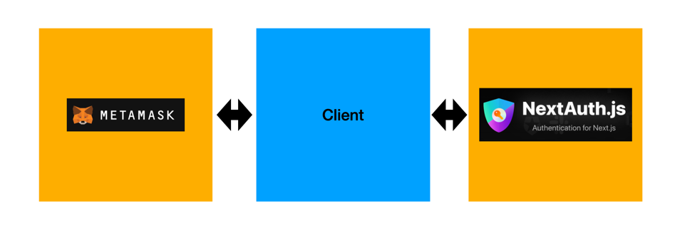

# 3편 - 사용자 인증


이번 편에서는 `next-auth`와 `MetaMask`를 활용하여 사용자를 인증하고 인가하는 방법을 알아보겠습니다.
간단한 개요는 이렇습니다.

1. MetaMask와 Web을 연결한다.
2. 연결 후 Next-auth에서 인증한다.
3. 발급된 jwt로 인증 유무를 판단하며 사용자에게 권한 부여를 해준다.
4. 로그아웃 시 지갑의 연결을 해제하고 JWT를 폐기한다.

:::tip
이제 코드에 들어가기 전에 앞서 설명드릴 것이 있습니다. 보통 dApp의 경우 실질적인 데이터는 모두 블록체인에 있기 때문에 API 서버가 없는 경우가 많습니다.
이렇게 말하다보면 굳이 next-auth를 쓸 것도 없이 wagmi의 `useAccount` 훅스만으로 인증 인가를 처리할 수 있을 것 같습니다.

그러나 규모가 커질수록 얘기가 달라집니다. 예를 들어 1만명의 데이터를 정렬해서 가져올 수 없고, 트래픽이 몰리면 조회가 느려지는 등 블록체인은 구조상으로 느리고 제약이 꽤나 있습니다.
그런 이유로 결국에는 API 서버를 구축해 블록체인에서 우리 서비스와 관련된 정보만 수시로 동기화해서 저장하여 우리 서비스의 비즈니스에 맞게 커스텀하고 조회하고 관리합니다.
그런 API 서버와 통신할 때 인증된 사용자만 할 수 있는 액션이 있다면 다시 JWT나 session 방식을 활용해야 합니다. next-auth는 인증을 빠르게 구현할 수 있고 Web3적으로도 지원하는
것이 많아서 이번 글에서 추천드리고자 채택되었습니다. 😃
:::

## Config

:::info next-auth
현재 시리즈는 dApp 개발 과정을 위한 컨셉이어서 next-auth에 대해 자세히 얘기하지 않고 있습니다.

next-auth에 대한 자세한 글은 [Next-auth 소개글](/front/next-auth/next-auth-introduction)를 한번 참고해주세요!
:::

```bash
npm install next-auth
```
먼저 next-auth를 설치해줍시다. 그 다음 next.js에서 요구하는 설정들을 추가해봅시다.


```tsx title="_app.tsx"
import type { AppProps } from "next/app";
import NextHead from "next/head";
import * as React from "react";
import { WagmiConfig } from "wagmi";

import { client } from "../wagmi";
import { SessionProvider } from "next-auth/react";

function App({ Component, pageProps: { session, ...pageProps } }: AppProps) {
    const [mounted, setMounted] = React.useState(false);
    React.useEffect(() => setMounted(true), []);

    return (
        <SessionProvider session={session}>
            <WagmiConfig client={client}>
                <NextHead>
                    <title>wagmi</title>
                </NextHead>
    
            {mounted && <Component {...pageProps} />}
            </WagmiConfig>
        </SessionProvider>
    );
}

export default App;
```

next-auth에서는 세션 정보를 Context API에 담아 전역적으로 접근할 수 있게 해주기 때문에 먼저 next-auth에서 제공하는 `SessionProvider`를 app에 감싸줘야 합니다.

`App`의 props 중 session 데이터를 `SessionProvider`에 바인딩해주는 모습을 볼 수 있는데요. 이 부분은 Nextjs 구조 상으로 인한 코드라고 생각하시면 되겠습니다.

:::tip pageProps의 세션을 사용하는 이유
[NextAuth의 설명](https://next-auth.js.org/v3/getting-started/client#provider)을 읽어보시면 이렇게 함으로써 서버 사이드와 클라이언트 사이드가

세션을 중복 체크하는 것을 피할 수 있다고 합니다. 그렇다면 중복 체크라는 것은 원래 어떤 동작을 한다는 뜻일까요?

Next.js에서 페이지는 필요에 따라 서버 측과 클라이언트 측에서 모두 렌더링할 수 있습니다.
- 서버에서 페이지를 렌더링할 때 : 서버에서 실행되고 브라우저로 전송되는 HTML이 생성됩니다.
- 클라이언트에서 페이지를 렌더링할 때 : JavaScript는 브라우저에 이미 로드된 후 페이지를 동적으로 업데이트하는 데 사용됩니다.

인증이라는 문맥에서 보면, 저희는 사용자가 로그인했는지 여부를 알아야 적절한 컨텐츠를 표시할 수 있습니다.
- 서버에서 페이지를 렌더링할 때 : 페이지가 렌더링되기 전에 사용자의 세션 상태를 외부에서 가져와(예를 들어 데이터베이스, API 서버) 확인합니다.   
- 클라이언트에서 페이지를 렌더링할 때 : 자바스크립트로 업데이트된 어플리케이션의 현재 상태를 읽어 사용자의 세션 상태를 확인합니다.

이 두가지 상황을 모두 커버할 수 있는 방법이 pageProps 객체의 세션 값을 Provider에 전달하는 것입니다. 이렇게 하면 페이지가 렌더링되는 위치에 관계없이 세션 상태를 일관되게 액세스할 수 있으며
확인하기 위한 논리를 두번 작성할 필요가 없습니다.
:::

```tsx title="pages/api/auth/[...nextauth].ts"
import NextAuth from "next-auth";
import Credentials from "next-auth/providers/credentials";

export default NextAuth({
    session: {
        strategy: "jwt",
    },
    providers: [
        Credentials({
            id: "MetaMask",
            name: "MetaMask",
            credentials: {
                address: {},
            },
            authorize(credentials) {
                const address = credentials?.address;

                return address ? { address, id: address, name: "Hank" } : null;
            },
        }),
    ],
});
```

다음으로는 Next.js 서버에서 인증을 담당할 api route를 만들고 로직을 작성해야 합니다. 

authorize 함수에서 인자로 들어오는 credentials는 로그인을 위해 받을 입력값들입니다.
구현하실 인증 양식에 따라 커스텀할 수 있습니다.

여기서 반환하는 값은 session에 담겨 사용자의 인증 상태나 정보를 액세스하는 데 활용됩니다. 로그아웃이 된다면 이 정보가 초기화됩니다.

이제 본격적으로 로그인하는 모습을 구현해보겠습니다.

## Login 

```tsx
import { useAccount, useConnect, useDisconnect } from "wagmi";
import { signIn, signOut, useSession } from "next-auth/react";

export function Connect() {
    const { data, status } = useSession();
    const { address, isConnected } = useAccount();
    const { connect, connectors } = useConnect();
    const { disconnect } = useDisconnect();
    const user = data?.user;
    const isLoggedIn = status === "authenticated";

    const handleLogout = () => {
        signOut();
        disconnect();
    };

    const handleConnectWallet = async () => {
        if (isLoggedIn) return handleLogout();

        const connector = connectors[0];
        connect({ connector });
        await signIn("MetaMask", { address, redirect: false });
    };

    return (
        <div>
            {user && <h1>{user.name} 님 안녕하세요 ^&^</h1>}
            <button onClick={handleConnectWallet}>
                {isLoggedIn ? "로그아웃" : "로그인"}
            </button>
        </div>
    );
}
```

설명은 길었었지만 코드는 짧습니다. 메타마스크를 연결하고 next-auth의 signIn 메소드만 호출해서 프로바이더의 네임과 필수 양식만 넣어주면 끝이 납니다.

이제 useSession에서 user의 정보를 액세스할 수 있습니다. 이전 글에서 언급한 지갑 이벤트에 따라 세션을 해제하거나 갱신하고 싶다면 next-auth의 signIn과 signOut으로 모두 해결 가능할 것입니다.


:::
다음 편에는 본격적으로 컨트랙트를 활용하여 Web3의 로직을 다뤄보려 합니다.
:::