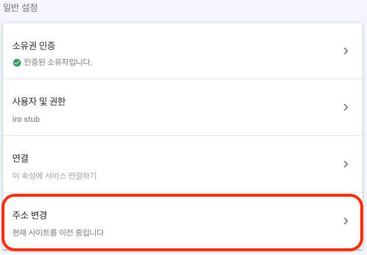
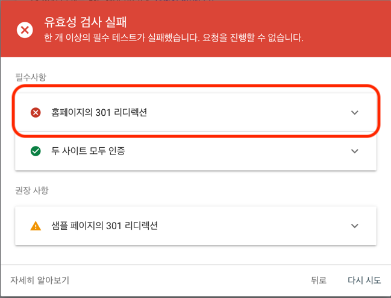
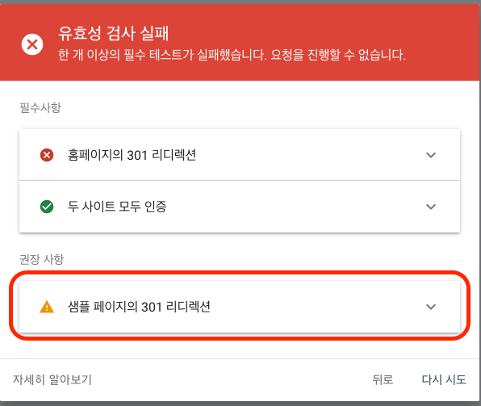
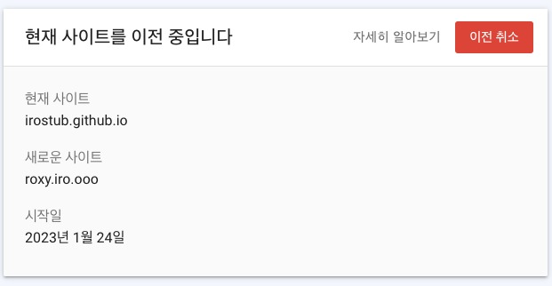

# Google Search Console 주소 변경(통합), 사이트 이전 방법

기존에 사용하던 도메인을 버리고 새로운 도메인으로 옮길 때 Google Search Console 에서는 어떻게 반영해야하는지 알아봅시다.

:::info 환경
기존 사이트 : Jekyll 기반, Github page 를 통한 호스팅 방식  
기존 도메인: https://irostub.github.io  
Google Search Console 등록 상태 : 등록되어있는 상태  

새로운 사이트 : docusaurus 기반, Self Hosting Server 를 통한 호스팅 방식  
새로운 도메인 : https://roxy.iro.ooo  
Google Search Console 등록 상태 : 등록되어있는 상태
:::

## 사이트 이전 시 Google Search Console
신규 블로그를 개설하며 기존 블로그의 글들을 이전했습니다. 신규 블로그는 기존 블로그와 다르게 도메인도 바뀌었고 글에 대한 url 체계도 변경되었습니다. 
어떻게 기존 블로그의 Google Search Console 에서 신규 블로그로 주소를 변경하고 이전 링크들을 연결해줄 수 있을까요?

사이트 이전 시, [Google Search Console 에서의 대응 방법](https://support.google.com/webmasters/answer/9370220)을 털어봅니다.
:::danger 주의
신규 블로그 및 기존 블로그 모두 Google Search Console 에서 소유권을 가진 상태여야합니다. 해당 글은 모두 소유권 등록이 되어있는 가정하에 작성합니다. 
소유권이 없다면 [`여기`](https://support.google.com/webmasters/answer/9008080?hl=ko)를 참고하세요.
:::

## 사이트 이전(주소 변경) 시작

### 주소 변경 화면 진입하기
기존 블로그의 Google Search Console 에 접속합니다. 그리고 설정 페이지에 진입하여 `주소 변경` 버튼을 찾습니다.



### 유효성 검사 시도 해보기


유효성 검사 및 업데이트 버튼을 눌러 유효성 검사를 시도합니다. 실패하더라도 괜찮습니다. 한번 먼저 눌러봅시다.
아마 다음과 같은 화면이 ~~반길겁니다~~. 하나씩 해결해봅시다.



### 홈페이지의 301 리디렉션 해결하기
필자는 기존 블로그는 Jekyll 을 사용하고 Github Page 에 배포되고 있었습니다. Github Page 에선 '/' 루트 url 에 대한 리다이렉트
 기능을 제공하지 않습니다[(참고)](https://gist.github.com/domenic/1f286d415559b56d725bee51a62c24a7). 그렇기에 저는 루트 페이지에서 보여지는 html 에 다음 헤더를 넣어주었습니다.

***url 를 신규 블로그의 url 로 넣어주세요.***

:::tip
http-equiv="refresh" meta 는 새로고침 시간을 content 로 주어주면 명시된 url 로 새로고침을 합니다.  
rel="canonical" link 는 동일한 내용의 중복 페이지가 있을 시 대표가 되는 url 명시합니다.
:::

```html
<!-- 
<head>
  <meta http-equiv="refresh" content="0; url=https://새로운.도메인.주소/" />
  <link rel="canonical" href="https://새로운.도메인.주소/"/>
</head>
-->

<head>
  <meta http-equiv="refresh" content="0; url=https://roxy.iro.ooo/" />
  <link rel="canonical" href="https://roxy.iro.ooo/"/>
</head>
```
기존 블로그에서 head 를 적용한 파일의 예시입니다. 저는 home.html 이 루트 페이지의 홈에 나타나는 화면이기에 이곳에 적용하였습니다.
이 글을 따라하신다면 '/' 루트 페이지에서 보여주는 html 에 헤더를 적용하시면 됩니다.


잘적용되었는지 확인하는 방법은 로컬에서 Jekyll 서버를 실행하신 뒤 http://localhost:4000 
에 접속하면 위에서 헤더에 명시한 https://roxy.iro.ooo/ 로 리다이렉트 되는 것을 확인할 수 있습니다.

### 권장 사항 - 샘플 페이지의 301 리디렉션 해결하기
이번엔 권장 사항에 있는 샘플 페이지의 301 리디렉션에 대한 문제를 해결해봅시다.



해당 드롭다운을 누르면 어떤 링크들이 리디렉션 되어야하는지 목록이나옵니다. 추정하건데, 외부 참조 링크로 사용되고 있는 경우 (다른 사용자가 참조로 링크를 사용한 때)
해당 링크들이 노출 되는 것 같습니다. 이제, 리스트에 있는 페이지를 신규 블로그에 옮긴 게시글 쪽으로 연결해주는 작업을 진행합니다.

### 신규 블로그에 있는 글로 기존 글을 연결하기 - plugin 설치
여기선 Jekyll 의 plugin  [`jekyll-redirect-from`](https://github.com/jekyll/jekyll-redirect-from) 을 사용하여 간편하게 기존 글의 메타데이터에 명시하는 방법으로 연결하겠습니다.

기존 Jekyll 프로젝트의 파일 중 프로젝트 루트 경로에 있는 `Gemfile` 파일에 다음을 추가합니다.
```shell
gem 'jekyll-redirect-from'
```

기존 Jekyll 프로젝트의 파일 중 프로젝트 루트 경로에 있는 `_config.yml` 파일에 다음을 추가합니다.
```yaml
plugins:
  - jekyll-redirect-from
```
:::tip _config.yml plugin 추가 방법
plugins 에 이미 여러 플러그인이 적용되어있을 수 있습니다. 이러한 경우 아래에 추가해주면 됩니다.
:::

터미널에서 다음 명령을 실행합니다.
```shell
bundle
```

플러그인 설치가 완료되었으며, 이제 마지막 하나의 작업이 남았습니다.

### 신규 블로그에 있는 글로 기존 글을 연결하기 - 메타 정보 추가
기존 블로그 게시글 .md 파일을 찾아서 메타데이터에 신규 블로그로 이어지는 링크를 추가합니다.
예를들어 기존 Jekyll 프로젝트의 A라는 글이 있다면 `A.md` 파일이 있을 것입니다. `A.md` 파일의 상단에 메타 데이터를 적을 수 있는데 이곳에 다음을 추가합니다.

링크는 신규 블로그에 옮긴 A.md 글의 링크가 되겠습니다. 제 경우 다음과 같습니다[(minimal mistake 참조)](https://mmistakes.github.io/minimal-mistakes/docs/layouts/#canonical-url).
```yaml
canonical_url: "https://roxy.iro.ooo/irostub/2021/03/02/github-organization-oauth"
redirect_to: https://roxy.iro.ooo/irostub/2021/03/02/github-organization-oauth
```
***적용 후 예시***
```yaml
---
title: github organizations 타 앱 OAuth 허용하기
category: information
tags:
  - github
  - intellij
  - OAuth
  - organizations
canonical_url: "https://roxy.iro.ooo/irostub/2021/03/02/github-organization-oauth"
redirect_to: https://roxy.iro.ooo/irostub/2021/03/02/github-organization-oauth
---
```
Jekyll 서버를 실행하신 후 해당 글로 이동하시면 신규 블로그로 redirect(이동) 되는 것을 봄으로써 잘 적용되었는지 여부를 확인할 수 있습니다. 

### 작업 완료 후
소스 상에서 연결 작업을 마쳤다면, 마지막 최종적으로 Jekyll 블로그를 배포해줍니다.  

이어서 배포가 완료되면 Google Search Console 로 돌아와 주소 변경에서 유효성 검사를 다시 시도해줍니다. 수고하셨습니다. 다음과 같은 화면을 보면 정상적으로 마친 것입니다.




