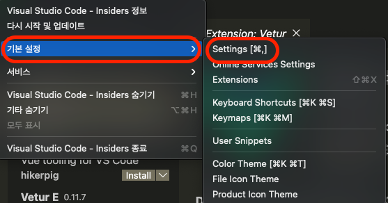

# .Vue 에서 HTML 자동완성 기능(Emmet)을 사용

이 답답한 일은 Vue 를 배우던 중 터졌습니다. 확장자가 \*.Vue 인 Vue Component 를 Visual Studio Code 에서 작성을 하고 있었습니다. 
Vue 컴포넌트 작성 간 해당 컴포넌트에 해당하는 Html 코드를 작성해야하는데
.html 파일에선 잘 작동하던 Emmet 기능이 .vue 에 선 제대로 작동하지 않았습니다. 이게 없어도 직접 다 코딩하면 되는 부분이지만,
프로그래머로써 귀찮은건 참을 수 없죠. 사소한거 하나도 자동화 하려고 하는 때에 Emmet 기능을 사용하지 못한다는건 버틸 수 없었습니다.

## 1. Vetur 플러그인이 설치되어있는지 확인하자

Vetur 플러그인은 Vue 를 위한 편리한 기능을 제공합니다. 예를들면 code highlighting, emmet, snippet 등이 있습니다. 
더 다양한 기능이 있는 것 같지만 일단 필자는 emmet 기능이 제일 절실했습니다.


플러그인에서 Vetur 를 검색하면 여러개가 나올텐데 그 중 Pine Wu 게시자의 Vetur 를 받습니다. 사실상 가장 다운로드 수가 많아서 이걸 설치하면 되겠구나 감이 올 것입니다. 플러그인을 설치했다면 꼭 재시작을 한번 해줍시다.


## 2. Emmet 사용자 설정을 하자

아마 Vetur 플러그인만 설치해도 Emmet 작동하는 사람도 있는 것으로 보입니다. 예상으론 Vue 2.x 버전을 사용하는지 Vue 3.x 버전을 사용하는지에 따라 다른 것 같은데 확실한 것은 아닙니다. 
Vetur 플러그인 설치만으로 Emmet 이 작동한다면 이 과정을 버리고 바로 해피 코딩타임을 즐기러 가시면 되겠습니다. 그게 아니라면 다음을 진행합시다.



VS code 에서 다음 메뉴를 누릅니다.


이어서 빨간 네모로 표시한 아이콘을 눌러서 settings.json 을 열어줍니다.
마지막에 다음과 같은 json 코드를 추가합니다.

```json
{
    "emmet.syntaxProfiles" : {
        "vue-html": "html",
        "vue": "html"
    }
}
```

수정된 모습


완료!

## 3. 되찾은 편안함

이제 Html 에 대한 Emmet 기능이 VS code 의 .vue 파일에서도 작동합니다. 해피 코딩타임!

(약어로 자동완성이 Emmet 기능인줄은 이때 찾다가 처음알았습니다)
